cmpe277Project-OnlineMediaStreaming
===================================

Project for CMPE277 (Smartphone Application Development) - Online Media Streaming App. 

Following are the features of the App: 

1. App provides Online and Offline Media Streaming. 
2. App uses RTSP Protocol to Stream Live Media.
3. App is capable to upload local Media File to Cloud and then broadcast using Adoble Flash Media Server.
4. App also have provision to Browse and watch videos from Cloud on any Mobile device.

ScreenShots
=============

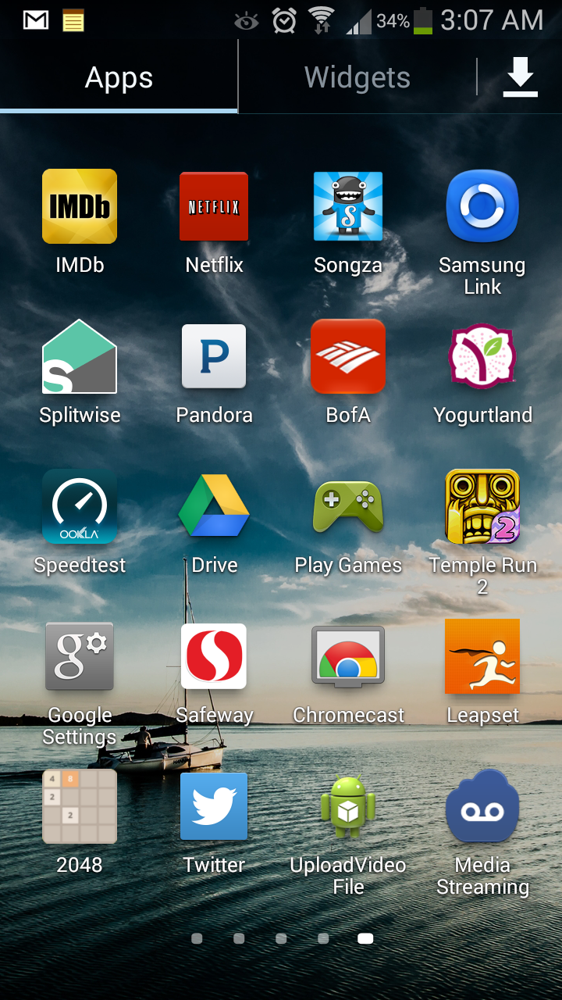

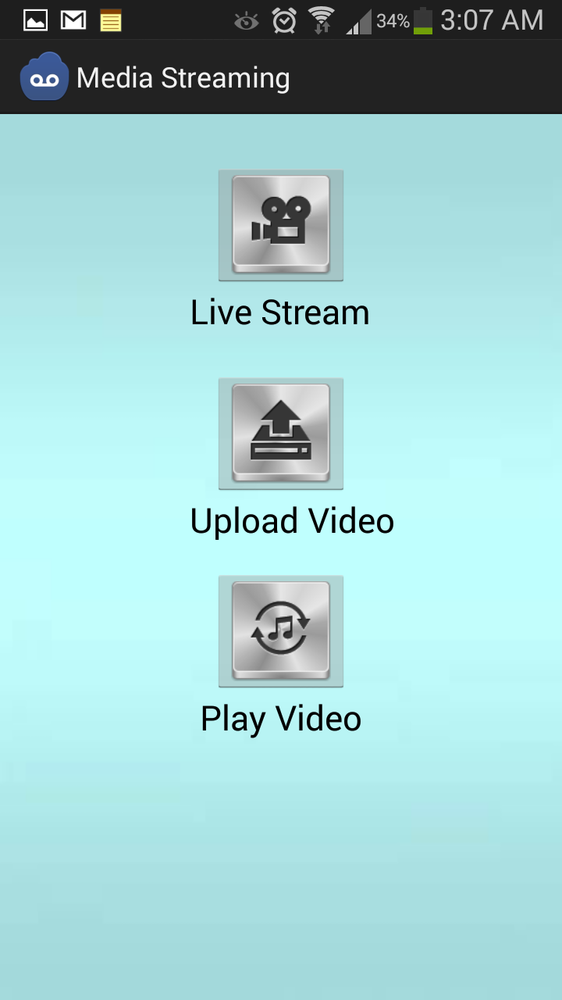

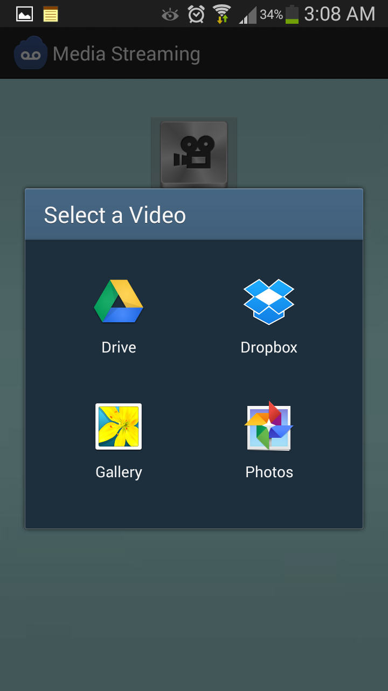

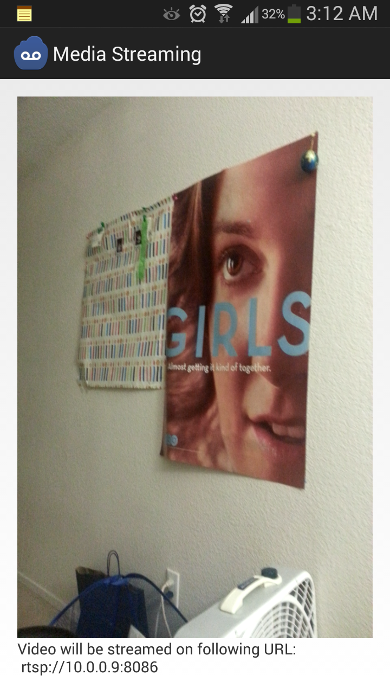

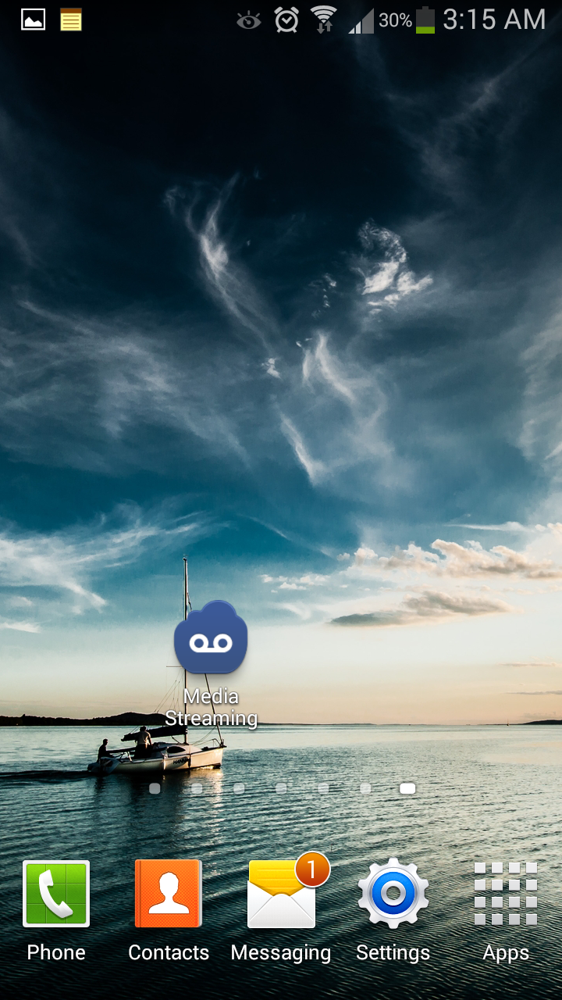

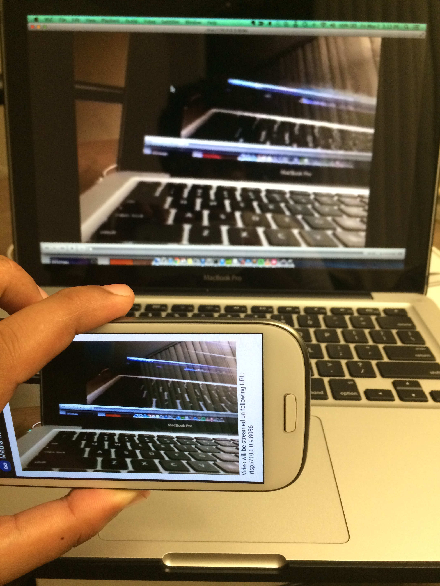

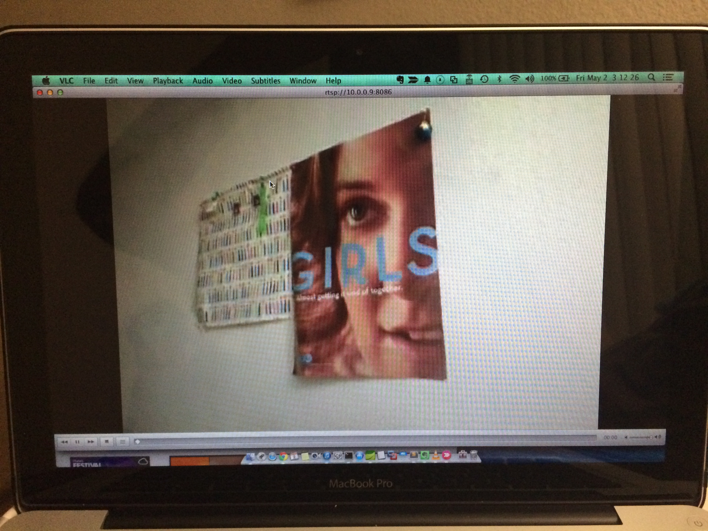

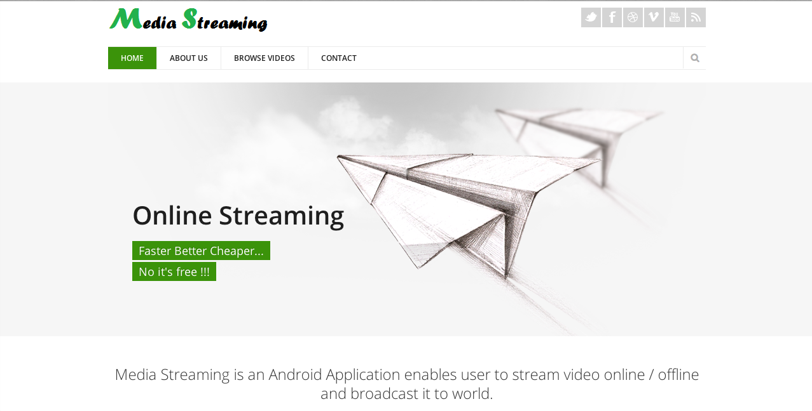

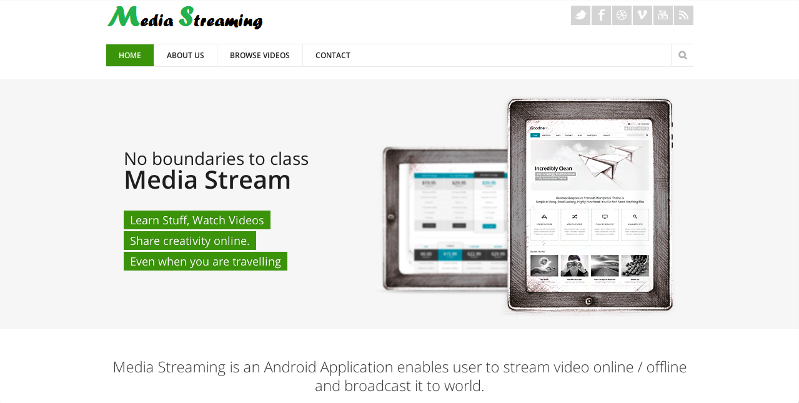

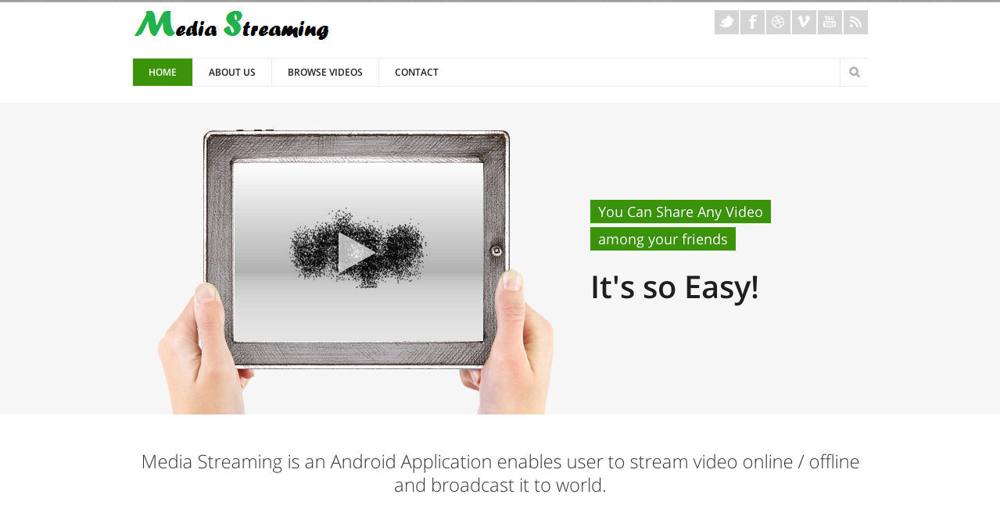

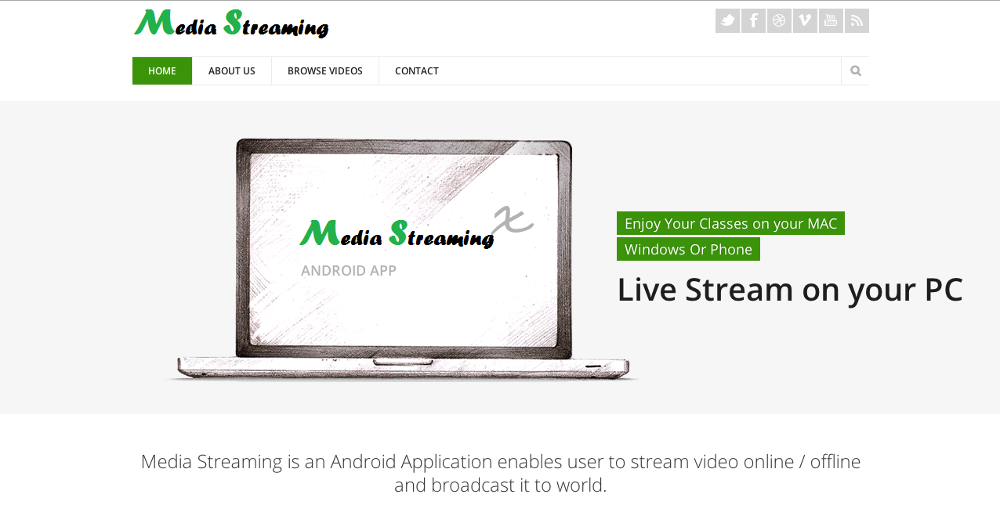

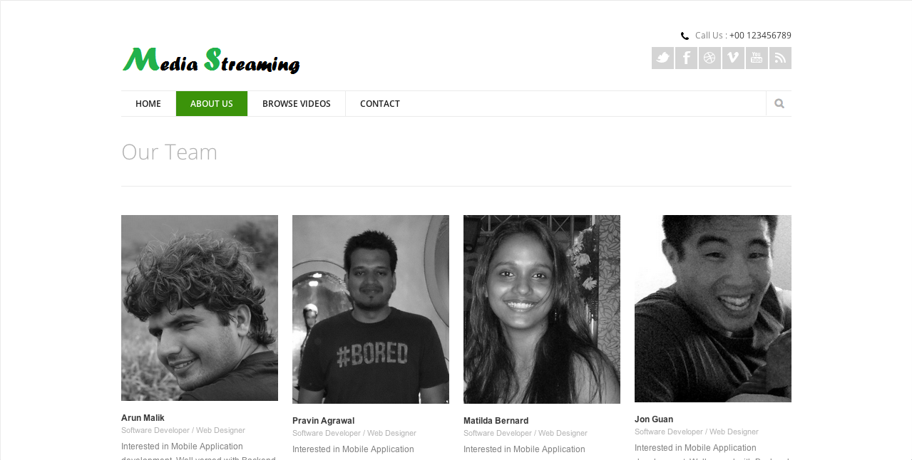

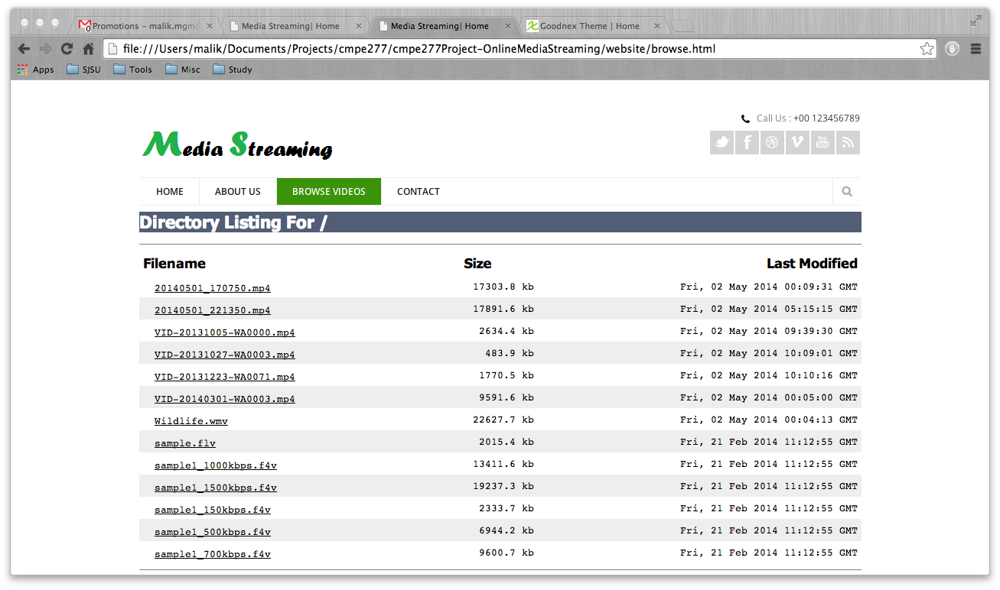

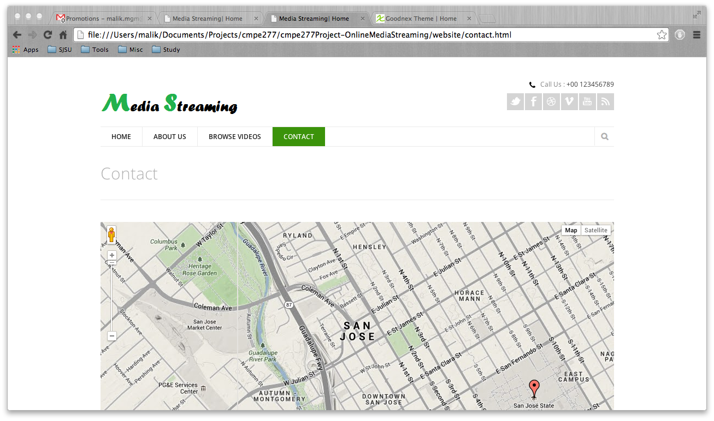