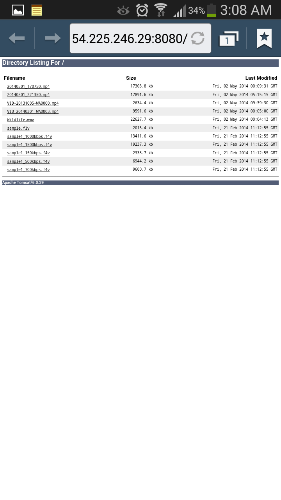
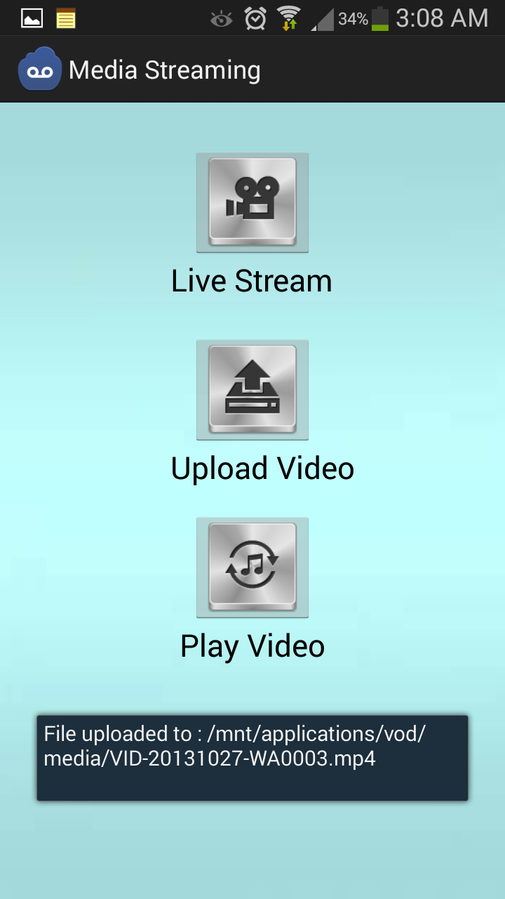

cmpe277Project-OnlineMediaStreaming
===================================

Project for CMPE277 (Smartphone Application Development) - Online Media Streaming App. 
Media Streaming is an Android Application enables user to stream video online / offline and broadcast it to world.

App is available on Play Store: http://goo.gl/kwf7DW

Following are the features of the App: 

1. App provides Online and Offline Media Streaming. 
2. App uses RTSP Protocol to Stream Live Media.
3. App is capable to upload local Media File to Cloud and then broadcast using Adoble Flash Media Server.
4. App also have provision to Browse and watch videos from Cloud on any Mobile device.

Steps: 
1. Live Stream: 
    a. Click Live Stream Button
    b. Open VLC player on your PC /MAC ( web based VLC plugin or any player able to stream media )
    c. Open network stream with URL displayed on your Mobile Screen. ( e.g : rtsp://10.0.0.9:8086 )
    d. Stream Live Video and Enjoy !!!!
2. Upload Video: 
    a. Record any Video from your Camera
    b. Click upload button on your Mobile App and upload the recorded video
    c. Video will be uploaded on this Website ( http://goo.gl/egrPyq )
    d. Share URL with your friends
3. Browse Video: 
    a. Click Play Video button on your App
    b. Select and Play any Video of your choice from Cloud.

ScreenShots
=============

